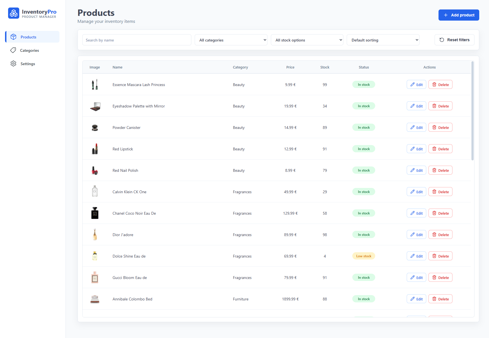
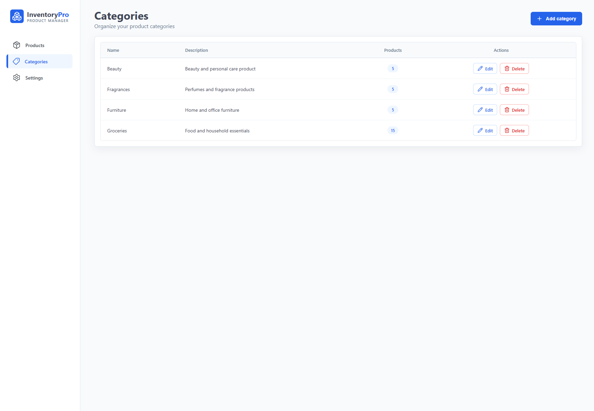
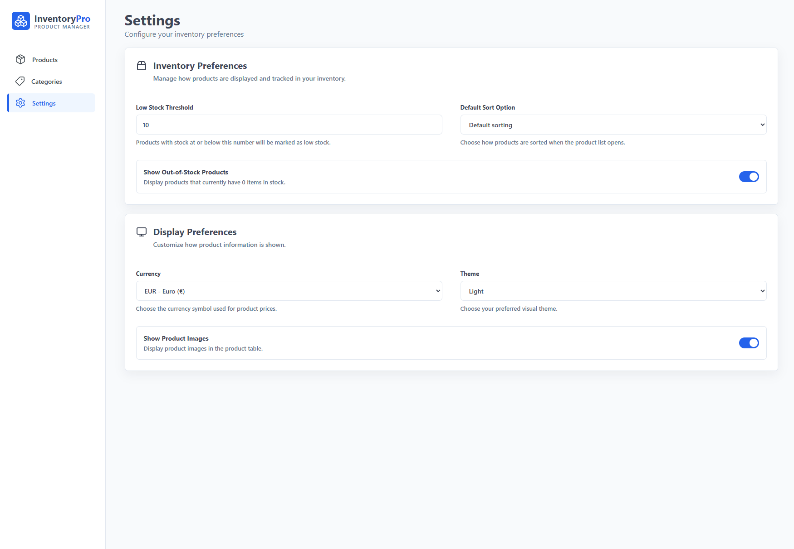
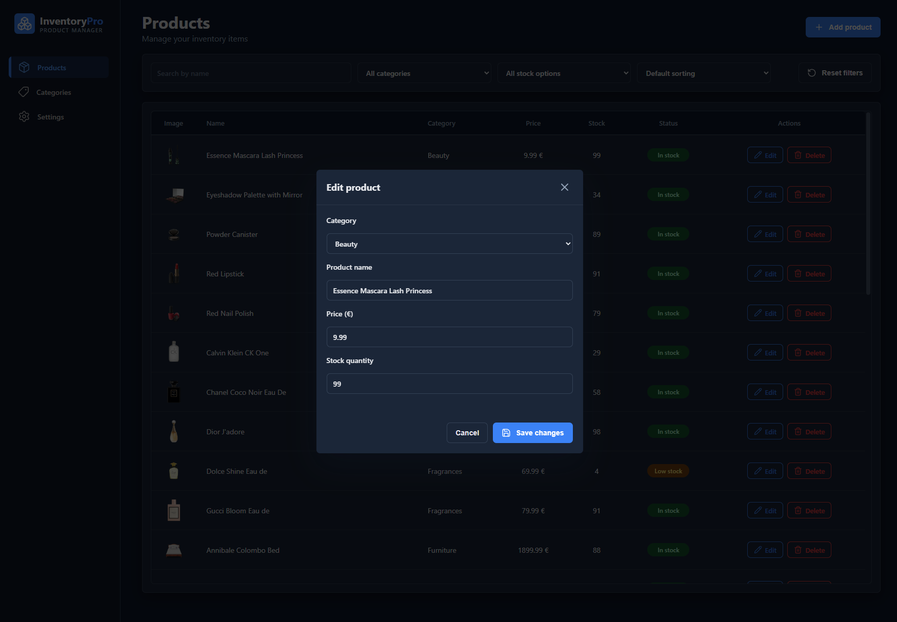

# InventoryPro - Product Inventory Dashboard

InventoryPro is a React + TypeScript inventory management dashboard for managing products, product categories, and inventory display settings.

The application fetches product data from an external API, transforms it into an internal application data model, and allows users to search, filter, sort, add, edit, and delete products. It also includes category management, stock status logic, configurable inventory settings, light/dark theme support, and a desktop-focused dashboard layout.

## Live Demo

Live demo: [InventoryPro](https://srdan-cakalj.github.io/product-inventory-dashboard/)

## Repository

GitHub repository: [product-inventory-dashboard](https://github.com/srdan-cakalj/product-inventory-dashboard)

## Features

### Product Management

* Fetch products from an external API
* Transform API product data into a custom application-specific product structure
* Display products in a clean inventory table
* Add new products
* Edit existing products
* Delete products with confirmation
* Search products by name
* Filter products by category
* Filter products by stock status
* Sort products by name, price, or stock
* Display product images
* Show placeholder icons for products without images
* Highlight newly added or edited products
* Show visual feedback before removing a product

### Category Management

* Display product categories on a separate categories page
* Add new categories
* Edit existing categories
* Delete categories
* Prevent duplicate category names
* Show product count for each category
* Prevent deleting categories that are currently used by products

### Inventory Settings

* Set the low stock threshold
* Mark products as low stock based on the selected threshold
* Show or hide out-of-stock products
* Choose the default product sort option

### Display Settings

* Switch between light and dark theme
* Change the displayed currency symbol
* Show or hide product images

### User Interface

* Sidebar navigation
* Products, Categories, and Settings pages
* Reusable modal layout
* Reusable form layout
* Form validation
* Table row highlight states
* Desktop-focused dashboard layout
* Scrollable tables with sticky table headers
* Icon-based buttons using lucide-react
* Loading and error states

## Tech Stack

* React
* TypeScript
* Vite
* CSS Modules
* Fetch API
* lucide-react
* GitHub Pages

## Project Purpose

The purpose of this project is to build a portfolio-ready inventory management dashboard while practicing TypeScript in a real React application.

The project focuses on typed data, typed props, typed state, event handlers, form handling, CRUD operations, API data transformation, UI state management, and component-based application structure.

Instead of using the fetched API data directly throughout the application, the API response is transformed into a custom `Product` type. This keeps the UI components independent from the exact structure of the external API and makes the project easier to maintain.

## API Data Transformation

The application does not use the external API response directly throughout the UI.

Instead, fetched product data is transformed into an internal application data structure.

Example:

```ts
type Product = {
    id: string
    name: string
    category: string
    price: number
    stock: number
    image: string | null
}
```

This approach separates external API data from internal application data. If the API structure changes, only the transformation logic needs to be adjusted, while the rest of the application can continue using the same internal `Product` type.

## Main Concepts Practiced

* React components
* TypeScript types
* Props typing
* State typing
* Function typing
* Event typing
* Form handling
* Form validation
* Conditional rendering
* List rendering
* CRUD operations
* Data fetching
* API data transformation
* Search functionality
* Filtering
* Sorting
* Stock status logic
* Modal handling
* UI feedback states
* Desktop-focused responsive layout
* CSS Modules
* Component-based project structure

## Application Structure

The project is organized around page-level components, feature components, reusable layout components, helper functions, hooks, and shared TypeScript types.

Main application areas:

* `Products` - product table, product filtering, sorting, searching, adding, editing, and deleting
* `Categories` - category table, category creation, editing, deleting, and product count display
* `Settings` - inventory preferences and display preferences
* `UI components` - reusable buttons, inputs, selects, and icon buttons
* `Layout components` - sidebar, page layout, modal layout, and form modal layout
* `Helpers` - formatting, validation, filtering, sorting, and data transformation logic
* `Types` - shared TypeScript types used across the application

## Layout

The application is designed as a desktop-focused dashboard.

It includes sidebar navigation, constrained content width for larger screens, scrollable tables, sticky table headers, and dashboard-style page layouts. The layout is optimized primarily for desktop and laptop usage rather than as a fully mobile-first interface.

## Screenshots

### Products Page



### Categories Page



### Settings Page



### Edit Product Modal - Dark Theme



## Getting Started

### 1. Clone the repository

```bash
git clone https://github.com/srdan-cakalj/product-inventory-dashboard.git
```

### 2. Open the project folder

```bash
cd product-inventory-dashboard
```

### 3. Install dependencies

```bash
npm install
```

### 4. Start the development server

```bash
npm run dev
```

### 5. Build the project

```bash
npm run build
```

### 6. Deploy to GitHub Pages

```bash
npm run deploy
```

## Future Improvements

Possible next steps for this project:

* Refactor modal and row feedback state into reusable hooks
* Extract more shared table logic between Products and Categories
* Add pagination or configurable rows per page
* Add persistent storage with localStorage or a backend
* Add user authentication
* Add unit tests for helper functions
* Add form library support for more complex validation
* Improve accessibility for modals and interactive controls
* Improve mobile navigation and small-screen layout support

## Status

The project is completed as a portfolio project.

The current version includes product management, category management, settings, theme switching, filtering, sorting, CRUD operations, and desktop-focused dashboard styling.
